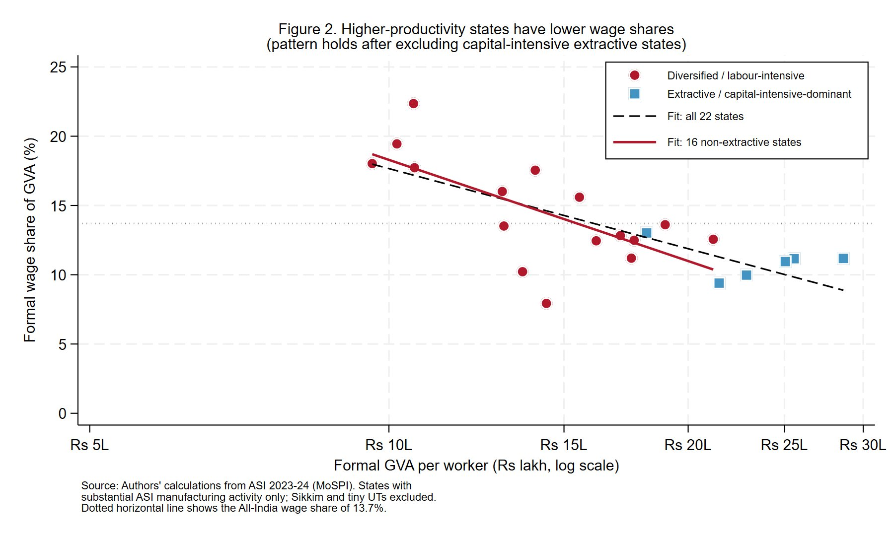

# Productivity up, wages flat

Replication package for **"Productivity up, wages flat: India's manufacturing growth has stopped working for its workers"** by Rahul Shukla (International Growth Centre), published in *Ideas for India* (2026).

> Article link: If the article is published, I will update the link here.

This repository contains the full data and Stata code behind every statistic and every figure in the article. Anyone can re-run the analysis end to end from the source workbook in a single do-file.



## The finding in one paragraph

Formal manufacturing productivity in India has more than doubled in fifteen years, but the share of that value added flowing to workers has kept falling. The all-India formal wage share of gross value added was **13.7%** in 2023-24, down from the 22.2% Kapoor (2020) recorded for 2000-01. The decline is not just a time-series story. Across Indian states in a single year, the more productive a state's formal manufacturing sector, the smaller the share of output that reaches workers, and the pattern holds after excluding capital-intensive extractive states. Among diversified-manufacturing states, the top five by productivity produce **1.7 times** as much per worker as the bottom five yet pay a wage share of roughly 13% against 19%.

## What is in this repository

```
.
├── analysis.do                       Stata do-file. Reproduces every number and figure.
├── productivity_wage_puzzle.xlsx     Source data workbook (ASI 2023-24 + ASUSE 2023-24, MoSPI).
├── figures/                          The three article figures, as produced by the do-file.
│   ├── figure1_productivity_timeseries.png
│   ├── figure2_wageshare_vs_productivity.png
│   └── figure3_top5_vs_bottom5.png
├── LICENSE
└── README.md
```

The do-file also writes a small intermediate file, `state_data.dta`, into the working directory while it runs. It is regenerated on every run and is excluded from version control, so you do not need it.

## How to reproduce

You need Stata 15 or later. No user-written packages are required.

1. Download or clone this repository to a folder on your machine.
2. Open `analysis.do` in Stata.
3. Edit the `cd` line near the top so it points to that folder. Use forward slashes in the path.
4. Run the whole file (Ctrl+D, or Execute).

The do-file reads the Excel workbook directly, so no manual data export is needed. On completion it writes the three charts to `figures/` and a full Stata log to a `logs/` folder it creates. To turn that log into something more readable, run the following in Stata after the run finishes:

```stata
translate "logs/analysis_log.smcl" "logs/analysis_log.txt", replace
```

## What the code reproduces

| Section | Output |
|---|---|
| 1 | Loads state-level data, builds derived variables, defines the 22 major-state and 16 non-extractive samples. |
| 2 | Descriptive statistics for the all-India, full, 22-major, and 16-non-extractive samples. |
| 3 | Pearson and Spearman correlations, the log-log wage elasticity, and the OLS slope of the wage share on log productivity. |
| 4 | Top-5 versus bottom-5 non-extractive state tables and group means. |
| 5 | Figure 1, the all-India productivity time series. |
| 6 | Figure 2, wage share against log productivity with both fit lines. |
| 7 | Figure 3, the top-5 versus bottom-5 comparison. |
| 8 | A printout of every headline number quoted in the article. |

The figures in this repository were generated in Stata. The versions in the published article were drawn in matplotlib, so fonts and styling differ slightly, but the data points, fit lines, and underlying numbers are identical.

## Data sources

All data is aggregated to the state-year or all-India level and is compiled from public releases by the Ministry of Statistics and Programme Implementation (MoSPI). The workbook contains no unit-level or firm-level records.

- Sheet1, state-level 2023-24 formal manufacturing GVA per worker and wages per worker from the Annual Survey of Industries (ASI), alongside informal manufacturing GVA per worker from the Annual Survey of Unincorporated Sector Enterprises (ASUSE).
- Sheet2, supporting ASI data with absolute GVA, worker counts, and total wages.
- Sheet3, the ASI all-India time series from 2008-09 to 2023-24.

## What this analysis does and does not show

The code reproduces a set of descriptive statistics and a cross-sectional relationship. It does not identify a causal mechanism. Several complementary explanations are consistent with the pattern, including the growth of contract labour (Kapoor and Krishnapriya 2019), state-level labour-market institutions, and dual-economy wage anchoring (Maiti and Marjit 2009; Rabbani and Raj 2024). The robustness check in Section 3, which shows the negative relationship survives within the 16 non-extractive major states, addresses the main composition concern but does not rule out every alternative.

## Citation

If you use this material, please cite:

> Shukla, R. 2026. "Productivity up, wages flat: India's manufacturing growth has stopped working for its workers." *Ideas for India*.

## License

Released under the MIT License. See [LICENSE](LICENSE). If you would prefer the data to carry a Creative Commons Attribution licence separate from the code, that can be added.
